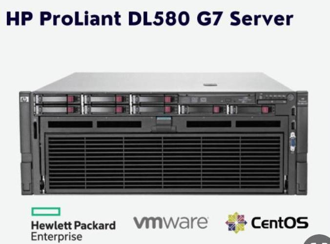
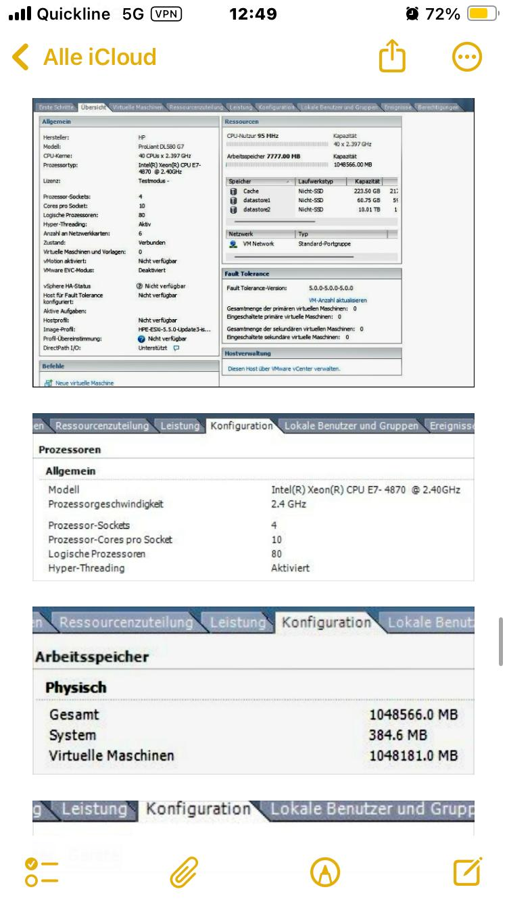

# 💥 HP ProLiant DL580 G7 in Switzerland — Enterprise-Class Server at a Fraction of the Price

Looking for a powerful, reliable, and affordable server for virtualization, development, or business needs?

## 🔧 HP ProLiant DL580 G7 — Key Features:
- ✅ **4x Intel Xeon CPU support** (up to 40 cores / 80 threads)
- ✅ **Up to 1TB DDR3 ECC RAM** — ideal for big data & virtualization
- ✅ **Hot-swappable drives, fans, and power supplies**
- ✅ **Integrated RAID Controller (Smart Array)**
- ✅ **iLO 3 remote management interface** for full remote control
- ✅ Fully compatible with **VMWare ESXi**, **CentOS**, **Windows Server**, and more

## 🎯 Perfect For:
- Home Labs & Virtualization
- Database Testing & Learning
- Enterprise Backup / NAS Server
- High-Availability Applications

💡 Hurry up and get the server at a low price before June 1, 2025.
💡 This server will be fully owned by a single buyer, ensuring maximum security and privacy.
💡 Extremely durable, enterprise-grade machine — available at an unbeatable price!

---

## 📬 Contact Info:

- 📧 Email: **autocadmdav@gmail.com**
- 💬 Telegram: [@yurii_code](https://t.me/yurii_code)
- 📱 WhatsApp: **+34 624 13 41 01**

---

🔥 Don’t miss out on this opportunity — bring enterprise power to your rack today!

